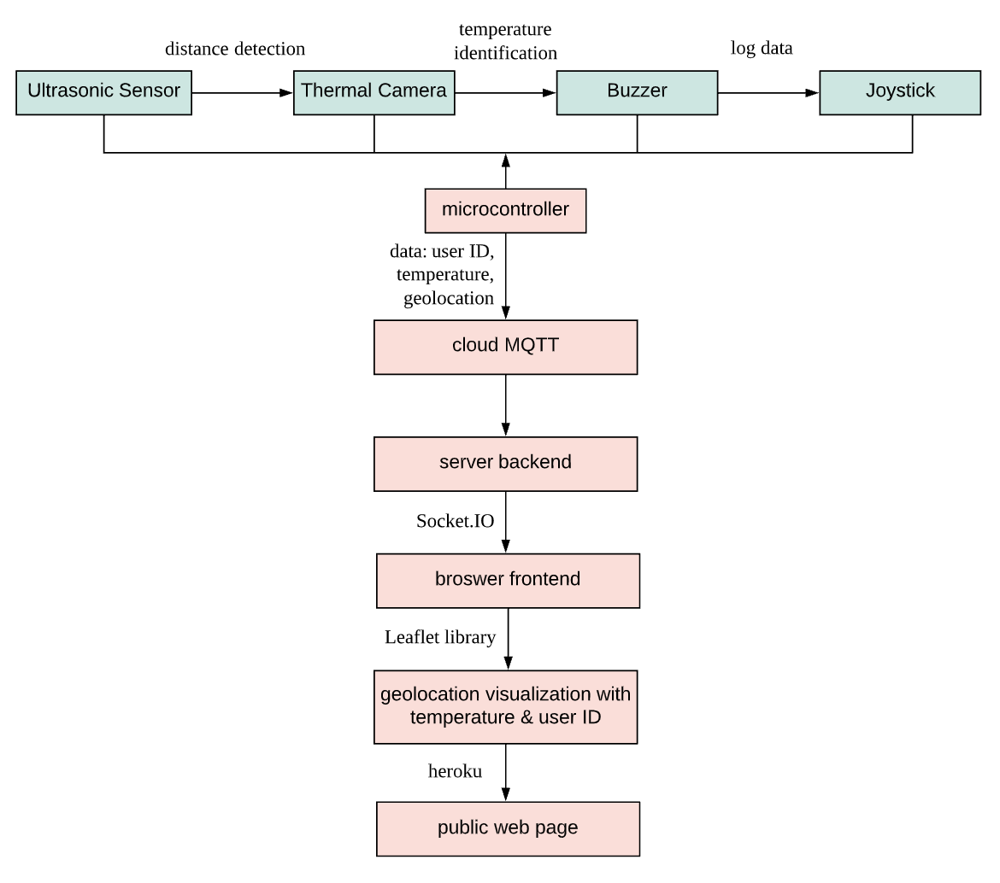
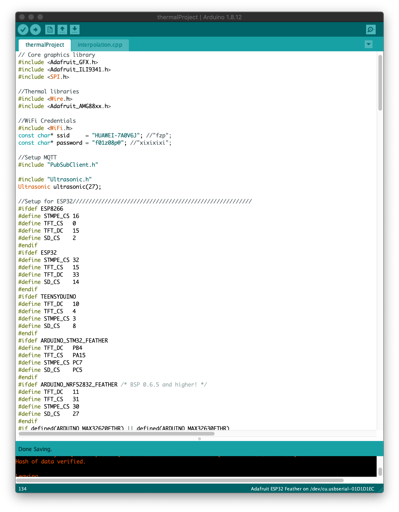

### CoronaHack
__Phyllis Fei__
__Extended Perception Spring 2020__
__Interactive Media Arts, NYU Shanghai__

---
#### Concept
CoronaHack is an augmented vision system that integrates a speculative cyberpunk wearable design and a real-time geolocation data system. It allows users to perceive a thermal imaging environment and extract temperature information from human subjects. When one’s temperature is detected as abnormal, CoronaHack will trigger warnings and log the person’s temperature and geolocation data to a cloud service. Data is visualized in real time on a virtual map that is accessible from any device. The system has a decentralized and open architecture, so that it contributes to citizen science and data spaces designed for the greater good.

Below are some key terms/technologies utilized in this project.

| Infrared Imaging Science                                   | MQTT|Socket.io|
| -------------                              |-------------|-------------|
| Aka thermography, it supports the augmentation of human vision. This project utilizes a thermal camera sensor to detect radiation in the long-infrared range of the electromagnetic spectrum and produces images of that radiation. When viewed through a thermal imaging camera, warm objects stand out well against cooler backgrounds, thus humans and other warm-blooded animals become easily visible against the environment. The warmer an object is, the more red appears in the visual output; the cooler an object is, the more blue is perceived.|Aka Message Queuing Telemetry Transport, a publish-subscribe network protocol that transports messages between devices. In CoronaHack it supports the functionality of receiving data from micro controllers and logging data to the network.|It is used in an environment to support pub/sub-architectures which provides a two-way transfer messaging system. Using _MQTT_ over _Socket.IO_ helps in activating all of MQTT features.|

---

#### Inspirations

| Projects                                   | Description|
| -------------                              |-------------|
| | [Coronavirus Detector](https://www.hackster.io/linterislinter/coronavirus-detector-d24e03?fbclid=IwAR1yWxsAL6jmWngAkXJKPXGQeodtpJXWTZKu8sF_5FQo2CG6vynuWHweP1w) is a wearable device that detects people's temperature. The led turns green if the detected person has a normal body temperature, and turns red if one's temperature is abnormal.|
|        | Chinese polices use [this helmet](https://www.facebook.com/SCMPVIDEO/videos/1093228981056223/) to perceive a thermal imaging environment with people's temperature being real-time detected from a long distance. If abnormal temperatures are detected, the helmet triggers its alarm to inform the polices.|


---

#### Physical Prototype

|  |
| -------------|

|  | |
|------------- |------------- |

---

#### Network Diagram
<br>
<p align="center">
  
</p>

__1. Hardware System__ (highlighted in green)
<br>
CoronaHack has four main hardware components as is shown in the diagram below. Ultrasonic sensor is used to detect the distance between the surrounding subjects and the wearer. If the distance exceeds the recommended social distance, a thermal imaging environment will be displayed on the screen along with people's body temperatures, supported by the thermal camera sensor. If a person's temperature is detected as abnormal, the buzzer will be triggered and the wearer is able to log the person's temperature data and geolocation data to the cloud service with the joystick.


__2. Software System__ (highlighted in pink)
<br>
Data logged from the microcontroller is first sent to cloud MQTT, then received in the backend of the server, and send to the browser frontend with socket.io. With leaflet javascript library, the geolocation data is visualized on a map in real-time. The real-time visualization is hosted by [heroku](https://www.heroku.com/) which enables the page to be open to the public. Everyone is able to access it with any device.


---

#### Code
__1. Arduino__

Below screenshots are some presets in Arduino in which libraries, credentials, and variables for thermal camera sensor, TFT display, ultrasonic sensor, piezo,  WIFI and MQTT are included and defined.
<table border="0">
 <tr>
    <td></td>
    <td></td>
    <td></td>
 </tr>
</table>

<br>
The TFT display screen remains black when the user is keeping a good social distance from the others. If the distance between the wearer and surrounding people exceeds the threshold, TFT display will start presenting thermal imaging environment to the wearer.

```
if (ultrasonicDist < 50) {
    //read all the pixels
    amg.readPixels(pixels);

    float dest_2d[INTERPOLATED_ROWS * INTERPOLATED_COLS];

    int32_t t = millis();
    interpolate_image(pixels, AMG_ROWS, AMG_COLS, dest_2d, INTERPOLATED_ROWS, INTERPOLATED_COLS);
    //Serial.print("Interpolation took "); Serial.print(millis()-t); Serial.println(" ms");

    uint16_t boxsize = min(tft.width() / INTERPOLATED_COLS, tft.height() / INTERPOLATED_COLS);

    drawpixels(dest_2d, INTERPOLATED_ROWS, INTERPOLATED_COLS, boxsize, boxsize, false);
  } else {
    tft.fillScreen(ILI9341_BLACK);
    tft.setCursor(20, 20);
    tft.setTextColor(ILI9341_WHITE);  tft.setTextSize(6);
    tft.print(ultrasonicDist, 1);
  }
```

Below shows how average temperature is calculated according to how much red is received from the thermal camera sensor. If the average temperature exceeds the threshold, meaning the human subject is detected to have an abnormal body temperature, CoronaHack triggers warnings.

```
double accumulator = 0.0;
  int readings = 0;

  for (int y = 0; y < rows; y++) {
    for (int x = 0; x < cols; x++) {
      float val = get_point(p, rows, cols, x, y);
      if (val >= MAXTEMP) colorTemp = MAXTEMP;
      else if (val <= MINTEMP) colorTemp = MINTEMP;
      else colorTemp = val;

      uint8_t colorIndex = map(colorTemp, MINTEMP, MAXTEMP, 0, 255);
      colorIndex = constrain(colorIndex, 0, 255);
      //draw the pixels!
      uint16_t color;
      color = val * 2;
      tft.fillRect(40 + boxWidth * x, boxHeight * y, boxWidth, boxHeight, camColors[colorIndex]);

      //Get the average of the thermal array
      accumulator += val;
      readings++;
      getAverage = accumulator / readings;
    }
  }

  //Average temperature triggers the sound here
  if (getAverage > 25) ledcWriteTone(0, 800);
  else ledcWriteTone(0, 0);
```
The wearer press the button to log the user ID, temperature data, and geolocation data to MQTT cloud service.

```
//Press the button to send the value to the MQTT broker
 int getButton = digitalRead(33);
 if (getButton == 0 && getButtonState == false) {
   mqttMessage();
   getButtonState = true;
 }
 if (getButton == 1 && getButtonState == true) {
   getButtonState = false;
 }
```

__2. Javascript__

MQTT broker receives the data from server backend, and with socket.io we send the data to the frontend.
```Ruby
function socketEvents(data){
	userArray.push(data.user);
	tempArray.push(data.temperature);
	latArray.push(data.latitude);
	lonArray.push(data.longitude);
	console.log(data.temperature);
}
```


Below shows how data received from the MQTT broker is visualized on an interactive map supported by [leaflet library](https://leafletjs.com/). Human figures who are "logged" by the wearer will appear as circles on the map. The higher (lower) the temperature is, the larger (smaller) and the more red (blue) the circles is.

```Ruby
for (let i=0; i<userArray.length; i++){
		loc[i] = myMap.latLngToPixel(latArray[i], lonArray[i]);
		tempArrayCol[i] = map(tempArray[i], 23, 30, 0, 255);
		fill(tempArrayCol[i], 0, (tempArrayCol[i] * -1)+255, 120);
		stroke(255, 255, 255);
		strokeWeight(2);

		tempArraySize[i] = map(tempArray[i], 23, 27, 10, 100);
		ellipse(loc[i].x, loc[i].y, tempArraySize[i] , tempArraySize[i]);

		distancePlace(loc[i].x, loc[i].y, userArray[i], tempArray[i]+9,tempArraySize[i]);
	}
```
We can get the user ID, temperature information when hovering on each data point on the map. The map can be hosted by heroku and anyone can access the map with the data visualization on any smart device.


```Ruby
var distanceCalc = dist(mouseX, mouseY, x, y);
	if (distanceCalc<s/2){
		var mapAlpha = map (distanceCalc, 0, 50, 255, 0);
		fill(0);
		noStroke();
		text("User ID: "+ u,x,y-6);
		text("Temperature: " + t,x,y+6);
		fill(222, 222, 222, mapAlpha)
	} else {
		fill (0, 0);
	}
```

[Here is the link](https://drive.google.com/file/d/1EPkONY6tLk7rsTEcUGpdcahZGndM82gU/view?usp=sharing) to download the full code.

---

#### Final Implementation

__[This is the demo](https://youtu.be/RLNpwWdvN1M)__ of the final implementation.

---

#### References
* [Coronavirus Detector](https://www.hackster.io/linterislinter/coronavirus-detector-d24e03?fbclid=IwAR1yWxsAL6jmWngAkXJKPXGQeodtpJXWTZKu8sF_5FQo2CG6vynuWHweP1w)
* [AI Helmet for Temperature Screening](https://www.facebook.com/SCMPVIDEO/videos/1093228981056223/?redirect=false)
* [DIY Arduino Thermal Camera](https://learn.adafruit.com/thermal-camera-with-display)
* [Map Systems with Mappa, Leaflet, P5](https://soniconlab.com/map-systems-mappa/)
* [Leaflet Library](https://leafletjs.com/)
